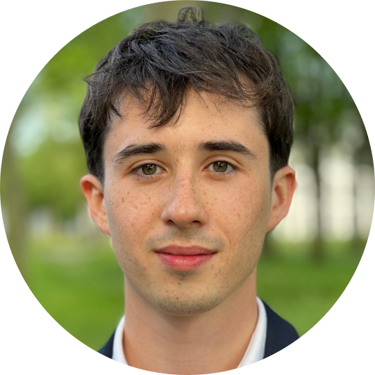

  

Hey, I'm Thibault Clara, an MSc Aerospace Engineering student at <a href="https://www.isae-supaero.fr/en/">ISAE-SUPAERO</a> in Toulouse, France. I previously completed a BSc in Aerospace Engineering at <a href="https://www.tudelft.nl/en/ae">Delft University of Technology (TU Delft)</a> in Delft, the Netherlands with a specialization in Artificial Intelligence for Engineering. 

I am particularly passionate about the emerging sustainable aviation sector to which I have contributed (and continue to contribue) to novel powertrain solutions whilst understanding the ClimateTech market and investments made into start-up's distributed globally. 

During my BSc, I contributed to <a href="https://aerodelft.nl/">AeroDelft</a>'s mission to promote the development of a (gaseous then liquid) hydrogen fuel-cell-powered demonstrator, a manned retrofitted Sling 4 aircraft. I had the opportunity to explore thermal management system design, gaseous hydrogen tank integration, imposing flight planning constraints, and identifying certification guidelines on system reliability that will be applicable to these up-and-coming experimental platforms.

During my MSc, I am helping with the development of the Engine Control Unit at <a href="https://h2.viraj.fr">Viraj H2</a>, a start-up designing a hybrid powertrain system equipped with a GH2 turbine and a fuel cell system with the aim of re-injecting water vapour emitted by the fuel cell system into the combustion chamber to increase power output and limit NOx emissions. 

I am constantly pushing to understand the multi-faceted design decisions involved in producing both existing and novel aircraft or spacecraft architectures. I am curious about developments in Guidance, Navigation, and Control (GNC) systems both in aeronautics and space, advancements in aerodynamics, and the growth of AI techniques in remote sensing/earth observation applications. Experienced in collaborating within dynamic and international settings, I have nurtured my open-mindedness, critical thinking, and leadership skills.
